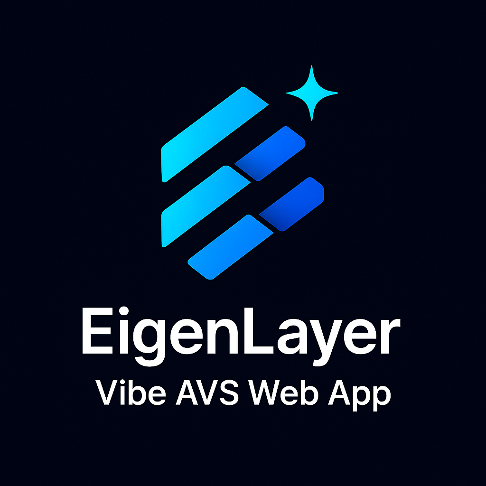

<div align="center">

</div>

# EigenLayer Vibe AVS Web App
"Idea to Design to AVS in under 10 minutes"

**Screenshot**


**Demo Site**
[vibe-avs-builder.vercel.app](https://vibe-avs-builder.vercel.app/)

**Soundtrack** [Vibes - Beastie Boys](https://www.youtube.com/watch?v=ClaNCCp2yRI)

## Running locally

1. Install Vercel CLI: `npm i -g vercel`
2. Link local instance with Vercel and GitHub accounts (creates `.vercel` directory): `vercel link`
3. Download your environment variables: `vercel env pull`

```bash
rm -rf node_modules
rm -rf .next/
pnpm install
pnpm next build

pnpm dev 
#or
pnpm next start
```

Your app template should now be running on [localhost:3000](http://localhost:3000).


Note: this app was forked from [Vercel Next.js AI Chatbot](https://vercel.com/templates/next.js/nextjs-ai-chatbot)


