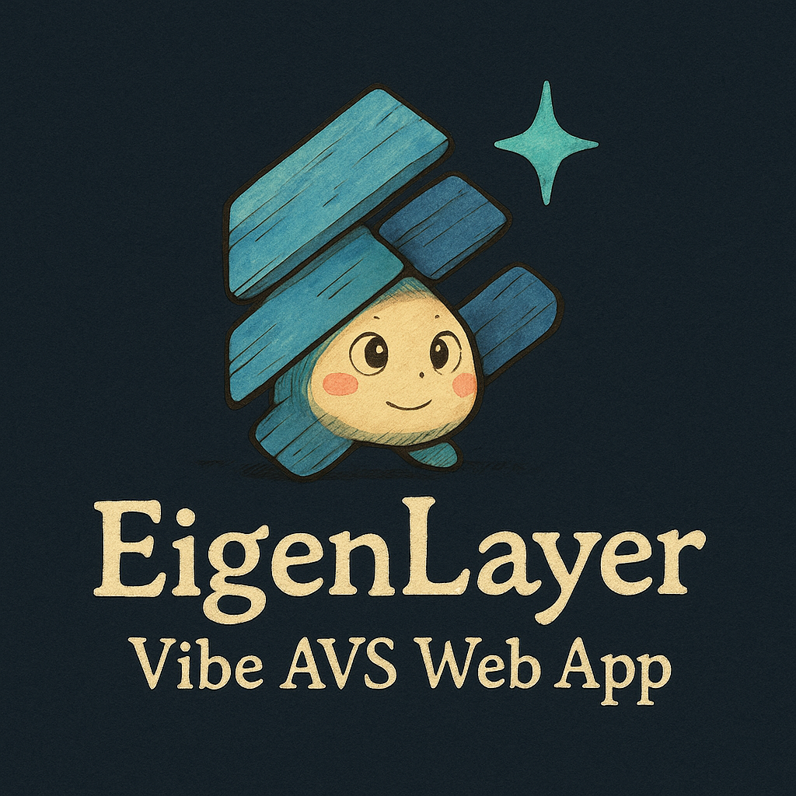

# EigenLayer Vibe AVS Web App

## Project Goals
- "**Anyone** can build an [AVS on EigenLayer](https://docs.eigenlayer.xyz/developers/Concepts/avs-developer-guide)"
- "Idea to Design to AVS in under 10 minutes"
- Benefits of Vibe Coding an AVS for less technical users.

  


## Demo Site
**[vibe-avs-builder.vercel.app](https://vibe-avs-builder.vercel.app/)**


## Instructions
How to Use The App:
- Choose whichever AI model you prefer for your testing from the dropdown.
- Click one the suggested example actions or begin chatting free form with the app about your AVS idea.
- You will be guided through 3 stages: idea refinement, design tech spec generation, and prototype code generation.
    - Idea refinement: the app will provide a refined AVS idea, provide feedback on how well your idea fits as an AVS on EigenLayer, and suggest enhancements to get more value from your idea on EigenLayer.
    - Design generation: the app will generate a complete Design Tech Spec for your AVS idea.
    - Prototype code generation: the app will generate a fully function prototype for your AVS idea based on the [hello-world-avs](https://github.com/Layr-Labs/hello-world-avs) example.
- Feel free to click one of the suggested actions to test its operation or skip through the three stages as you like.


## Running locally

1. Install Vercel CLI: `npm i -g vercel`
2. Link local instance with Vercel and GitHub accounts (creates `.vercel` directory): `vercel link`
3. Download your environment variables: `vercel env pull`

```bash
rm -rf node_modules
rm -rf .next/
pnpm install
pnpm next build

pnpm dev 
#or
pnpm next start
```

Your app template should now be running on [localhost:3000](http://localhost:3000).


Note: this app was forked from [Vercel Next.js AI Chatbot](https://vercel.com/templates/next.js/nextjs-ai-chatbot)


# Testing

Tests:
```
npx jest tests/codeGen/generateZipFromJSON.test.ts
```

# Appendix

Soundtrack: [Vibes - Beastie Boys](https://www.youtube.com/watch?v=ClaNCCp2yRI)

<div align="center">


</div>
